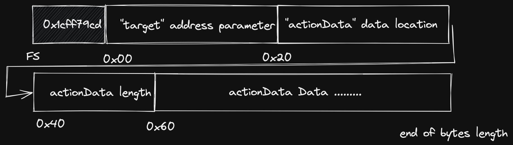
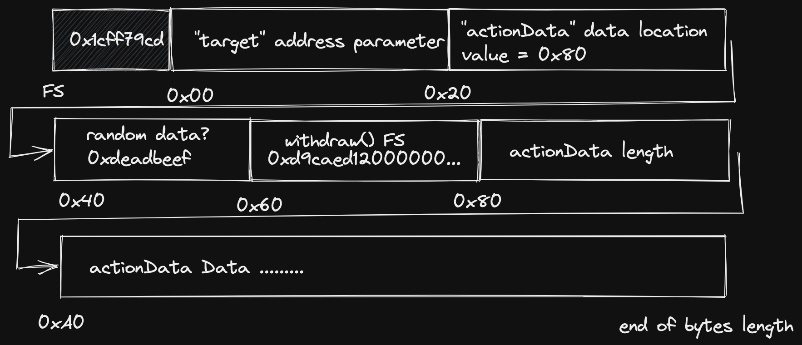

# Solution

漏洞分析：

- **主要原因**：

  在`AuthorizedExecutor::excute()`中硬编码 calldata 的偏移量`uint256 calldataOffset = 4 + 32 * 3;`导致出现潜在问题

- **漏洞后果**：

  `excute()`该函数本该是作为调用 `withdraw()` 函数的手段来定时定量地从 vault 中取出 token，而 vault 中的`sweepFunds()`函数也可以通过`execute()`来进行执行，
  即便合约在初始化之初没有囊括`sweepFunds()`的函数签名作为被允许的函数；也就是说函数中的 if 条件不能阻拦用户执行 permissions 列表中为 false 的动作

```c++

    function execute(address target, bytes calldata actionData) external nonReentrant returns (bytes memory) {
        // Read the 4-bytes selector at the beginning of `actionData`
        bytes4 selector;
        uint256 calldataOffset = 4 + 32 * 3; // calldata position where `actionData` begins
        assembly {
            selector := calldataload(calldataOffset)
        }

        if (!permissions[getActionId(selector, msg.sender, target)]) {
            revert NotAllowed();
        }

        _beforeFunctionCall(target, actionData);

        return target.functionCall(actionData);
    }

```

<br/>

- **原理解析**：

在代码中，`SelfAuthorizedVault::withdraw()` 和 `SelfAuthorizedVault()::sweepFunds()` 中都被`onlyThis()`修饰，`msg.sender`只能是合约本身，也就是说只有合约自身的函数才能调用这些函数。
`execute()`函数成为唯一的调用这些函数的方法。`execute()`函数犯错就在于第一段代码：

```c++

bytes4 selector;
uint256 calldataOffset = 4 + 32 \* 3; // calldata position where `actionData` begins
assembly {
selector := calldataload(calldataOffset)
}

```

第一段是定义一个四字节的函数选择器 `selector` 以及硬编码一个偏移量 `calldataOffset`, 再通过汇编方法`calldataload()`取出 calldata 中偏移过 4+32\*3 这么多的数据的前四个字节作为函数选择器 `selector`.（这里的 calldata 也就是`execute(address, bytes)`函数签名+address+bytes 参数，结构如下图）

<p align="center">

</p>

这个方法本来如果正常按上述方法传入是没问题，bytes 是动态变量，对应参数的第一个 32 字节槽是指针，告诉 evm 偏移多少字节才是真实的数据，该包括数据的大小（比如对于 array 是元素数量，对于 bytes 是字节的多少）和数据的参数

```bash
//假设withdraw的函数签名为0x12345678
 cast calldata "execute(address,bytes)" 0xB36bbd58265B9D7BbdF3e1d142fA26CEc75BC073  0x1234678d58265B9D7BbdF3e1d142fA26CEc75BC123

0x1cff79cd000000000000000000000000b36bbd58265b9d7bbdf3e1d142fa26cec75bc073000000000000000000000000000000000000000000000000000000000000004000000000000000000000000000000000000000000000000000000000000000151234678d58265b9d7bbdf3e1d142fa26cec75bc1230000000000000000000000

//上述数据偏移100位后再取bytes4就能得到12345678
```

<br/>

但是，由于选择了硬编码偏移 100 位字节，也就给了我们可乘之机，发出的 calldata 偏移 100 位后是 12345678，就能绕开 if 条件。同时我们的指针却指向另一个位置，而不是上面指向的 40，来让最后成功 call`sweepFund()`函数而不是`withdraw()`（如下图）

<p align="center">

</p>
